# Local Food Waste Management System

This project is a **Local Food Waste Management System** developed using **Python, SQL, and Streamlit**.  
The main goal is to reduce food waste by efficiently tracking food availability from local providers and distributing it to people in need.  

Key features include:  
- Add and manage food providers  
- Track available food and expiry dates  
- Analyze food waste trends using charts and reports  
- Interactive Streamlit dashboard with filters for location, food type, and provider  

This project demonstrates **data management, analysis, and visualization** in a real-world social impact scenario.

# Screenshots

## 📸 Screenshots

### Home Page
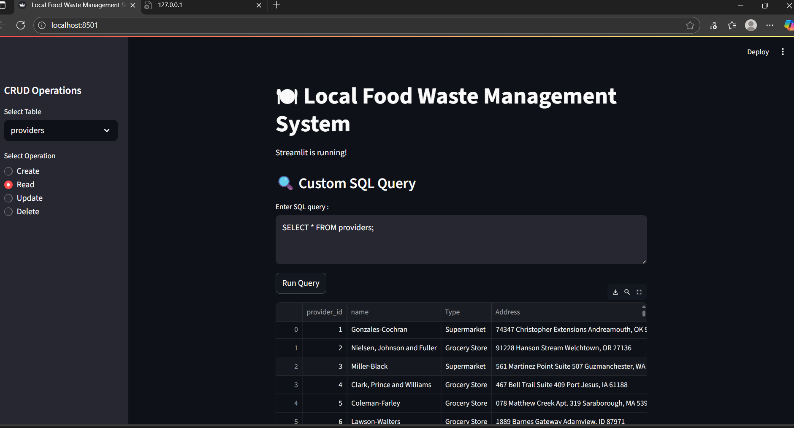

### Add Provider
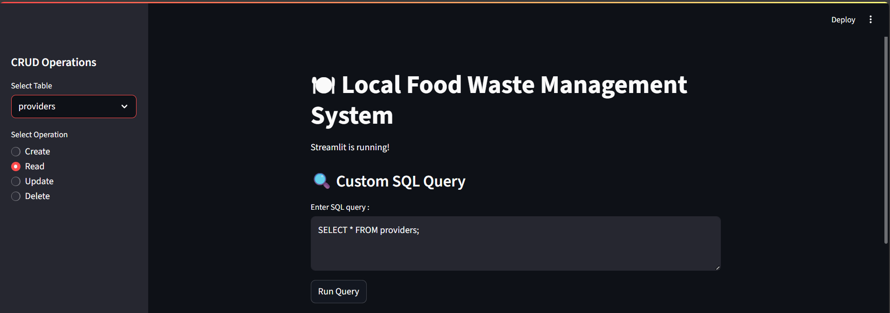

### All receivers
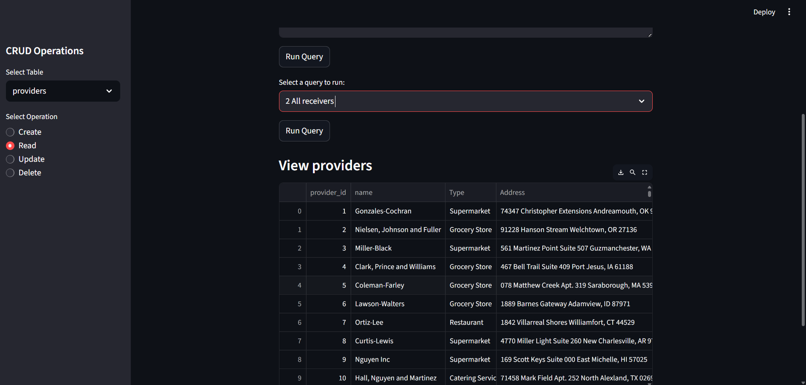

### All available food type
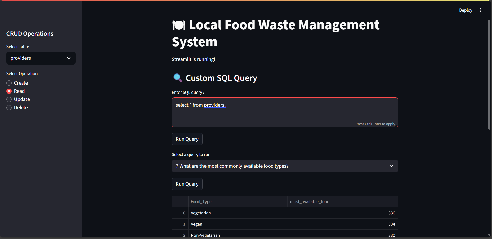

### city with highest food
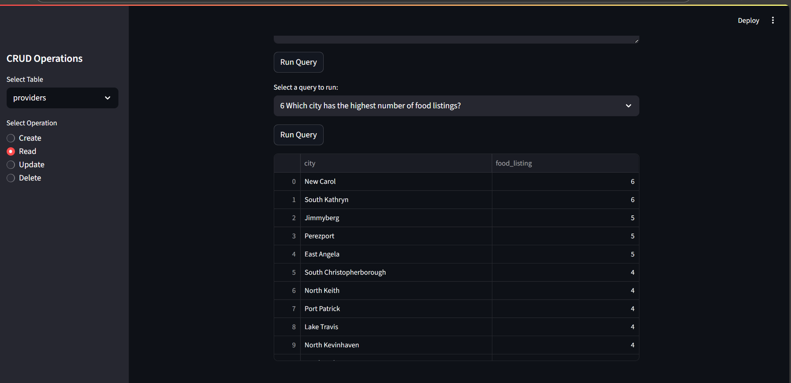

### food provider type
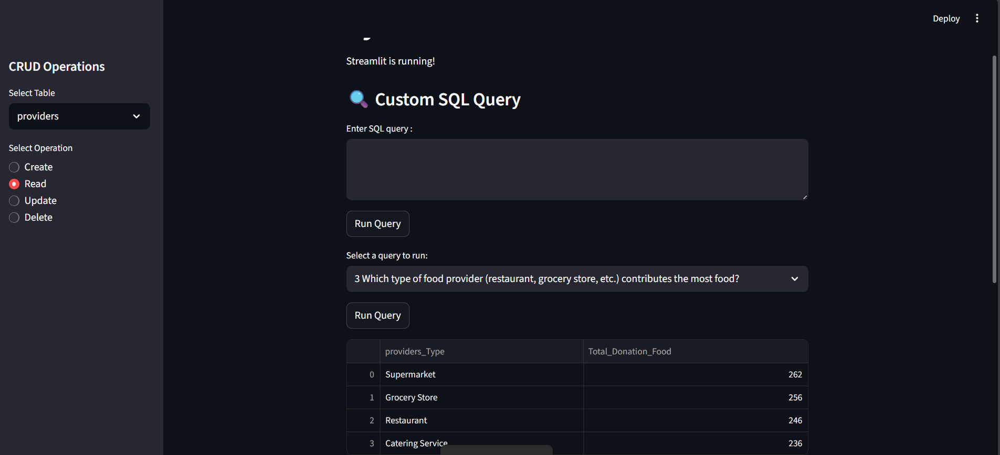

### food providers in specific city
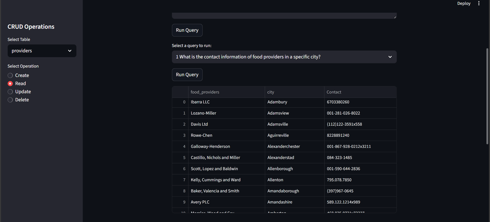

### highest food claim

### meal type
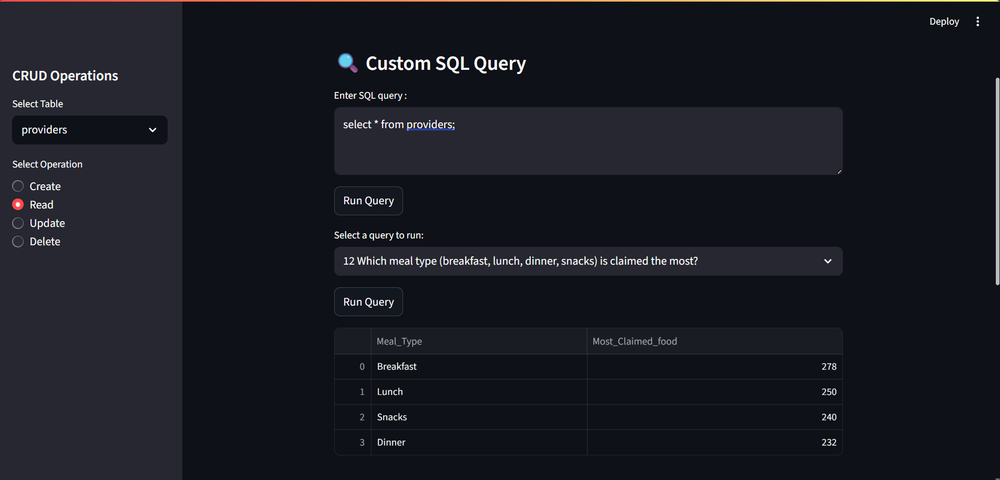

### receivers claimed most food
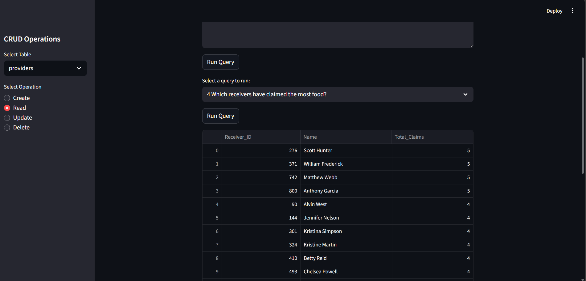

### total quantity food from all provider

### food donated by each provider
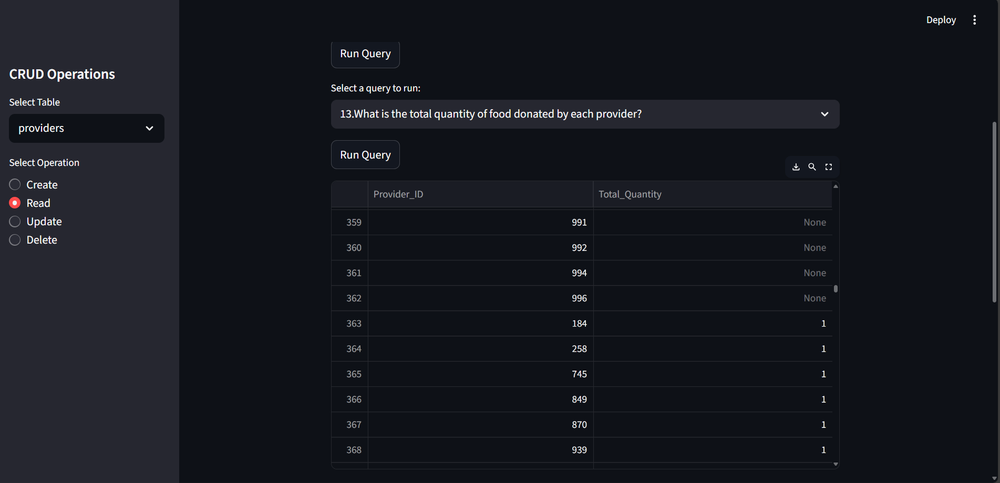

### food providers and receivers
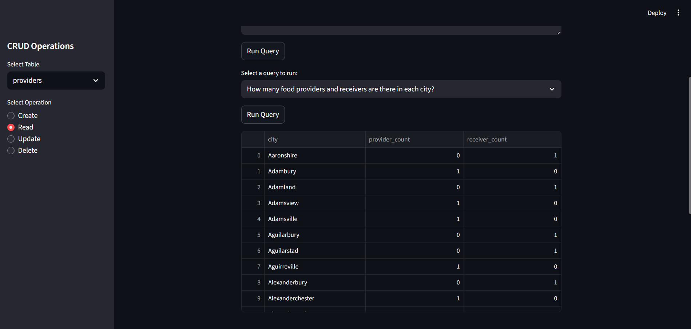

