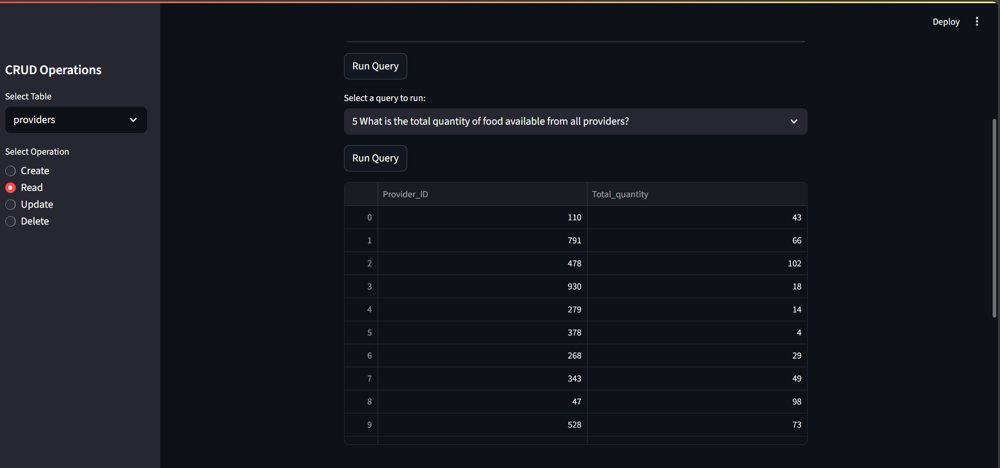

# Screenshots

## 📸 Screenshots

### Home Page

### Add Provider

### All receivers

### All available food type

### city with highest food

### food provider type

### food providers in specific city

### highest food claim

### meal type

### receivers claimed most food

### total quantity food from all provider

### food donated by each provider

### food providers and receivers

